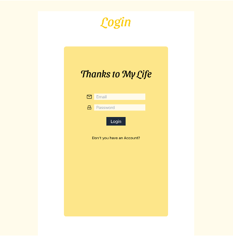
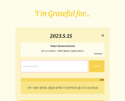
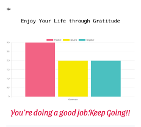
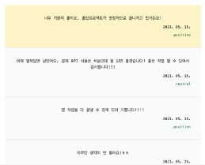

# Gratitude Journal

> _毎日感謝を記録する習慣を身に付けましょう！_  
> 開発者：Yejin Ha

  

# 概要

感謝をすればするほど、人間は肯定的な考え方を持つようになります。
私は学校にいながら、どんどん感謝をしなくなり、否定的に考えるようになりました。
これを変えるため、Gratitude Journal という WEB を作りました。
  

# 特徴

1. 感謝を記録することができます。
2. CLOVA SENTIMENT API を利用し、感情を分析します。
3. 毎日９時になると、PUSH NOTIFICATION で感謝をするようにお知らせします。
4. LOGIN／REGISTER ができ、自分の書いた感謝は自分だけ見ることができるよう、セッティングしておきました。
     

# イメージ

  FIREBASEのAUTHを利用し、Authenticationができるようにしました。  

 毎日感謝を記録します。知らない人の感謝の一言がメインページに表示されるようにしました。  

 CLOVA SENTIMENT APIを使って、自分の入力した感謝がポジティブなのか、普通なのか、否定的なのかをChartで見ることができます。結果につれて、様々な応援のメッセージが表示されます。  

 今まで書いた感謝リストです。Txtファイルで保存できるようにしました。感謝したことの感情も見ることができます。  
